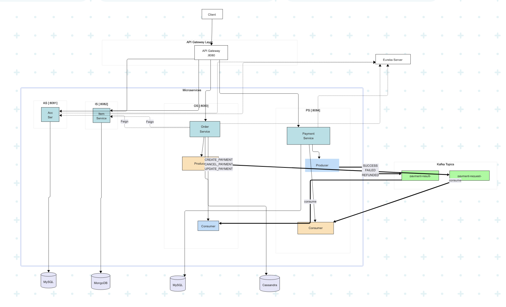

# 4 Microservices Architectural Diagram

Distributed E-commerce System Architecture



This distributed e-commerce system demonstrates a microservices architecture built with Spring Boot, implementing four core services that communicate through both synchronous REST/Feign calls and asynchronous Kafka messaging.  
The Account Service handles user authentication and authorization using JWT tokens with BCrypt password encryption, storing user data in MySQL.    
The Item Service manages product catalog and inventory using MongoDB for flexible schema storage, supporting paginated queries and real-time stock management.   
The Order Service orchestrates the purchase flow, leveraging Apache Cassandra for high-throughput order storage while coordinating with other services through Feign clients for inventory validation and Kafka events for payment processing.    
The Payment Service processes payment requests asynchronously via Kafka message consumption, implementing idempotency checks to prevent duplicate payments and storing transaction records in PostgreSQL. 
While the system showcases modern distributed patterns including event-driven architecture, service discovery through Eureka, and API Gateway routing, it currently operates in development mode with simplified payment logic and relaxed security configurations that would require hardening for production deployment.


### Account Service User Flow & Data Flow
##### User Flow
1. Account Registration Flow

User submits registration data via POST /api/accounts (email, username, password, shipping address, billing address, payment method)  
System validates email uniqueness, rejects if duplicate exists  
Password encrypted using BCrypt before storage  
UUID generated as accountId  
Returns created account information  

2. User Login Flow

User submits credentials via POST /api/auth/login (email and password)  
System queries account by email  
BCrypt validates password match  
JWT token generated upon successful validation (24-hour expiration)  
Returns token for subsequent requests  

3. Token Validation Flow

Other services validate token via GET /api/auth/validate  
Checks Authorization header format (Bearer token)  
JwtUtil validates token signature and expiration  
Returns boolean validation result  

4. Account Management  

Get account: GET /api/accounts/{accountId} returns account information directly  
Update account: PUT /api/accounts/{accountId} supports partial updates (only non-null fields)  

##### Data Flow
1. Inbound Data Flow     


   Client Request → Spring Security Filter (currently disabled, all requests permitted)  
   → Controller Layer (@Valid parameter validation)  
   → Service Layer (business logic)  
   → Repository Layer (JPA data access)  
   → MySQL Database
 

2. Data Transformation Flow  

DTO Layer: AccountRequest, LoginRequest for receiving request data  
Entity Layer: Account entity maps to database table  
Password Processing: Plain text → BCrypt encryption → Storage  
Token Generation: accountId → JWT token (containing subject, issued time, expiration time)  

3. Exception Handling Flow  

Business exceptions (e.g., account not found, duplicate email) → RuntimeException → GlobalExceptionHandler → 400 response  
Validation exceptions (@Valid failures) → MethodArgumentNotValidException → Returns field-level error details  
Unknown exceptions → 500 server error  

4. Security-Related Data Flow  

JWT Secret Key: Hardcoded in JwtUtil (should be externalized in production)  
Token validation: Session-independent, completely stateless  
Current Spring Security configured for development mode (all requests permitted), JwtAuthenticationFilter not actually enabled  

### Item Service User Flow & Data Flow
##### User Flow
1. Item Creation Flow  

Admin submits item data via POST /api/items (UPC, name, price, pictures, metadata)  
System validates UPC uniqueness to prevent duplicate entries  
Item saved with MongoDB-generated itemId  
Inventory record automatically created with 0 available units  
Returns created item with 201 status  
 
2. Item Query Flow  

Query by MongoDB ID: GET /api/items/{itemId}  
Query by UPC: GET /api/items/upc/{upc}  
Paginated listing: GET /api/items?page=0&size=10&sortBy=itemName&sortDir=asc  
Supports dynamic sorting and pagination parameters  

3. Inventory Management Flow  

Get full inventory: GET /api/inventory/{itemId} returns complete inventory object  
Quick availability check: GET /api/inventory/{itemId}/available returns integer count  
Update inventory: PUT /api/inventory/{itemId} replaces entire quantity (not incremental)  

4. Item Update/Delete Flow  

Update item: PUT /api/items/{itemId} supports partial updates (non-null fields only)    
Delete item: DELETE /api/items/{itemId} accepts either UPC or MongoDB ID   
Cascading delete removes associated inventory record  

Data Flow  
1. Inbound Data Flow   
   Client Request → Controller Layer (@Valid validation)   
   → Service Layer (business logic + cross-entity validation)   
   → Repository Layer (Spring Data MongoDB)    
   → MongoDB Database (items + inventory collections)    
2. Data Structure & Relationships    

Dual ID System: MongoDB auto-generated itemId (primary) + business UPC (unique index)  
Item-Inventory Relationship: One-to-one, linked by itemId  
Flexible Schema: MongoDB allows dynamic metadata storage via Map<String, Object>  
Transaction Support: @Transactional ensures atomic item+inventory creation  

3. Data Transformation Flow  

DTO Layer: ItemRequest for input validation  
Entity Layer: Item and Inventory documents for MongoDB  
No explicit mapper - manual field copying in service layer  
Pagination: Spring Data Page wrapper for list responses  

4. Exception Handling Flow  

Validation failures (@Valid) → 400 Bad Request  
Entity not found → RuntimeException → 500 (no global handler configured)  
Duplicate UPC → RuntimeException with descriptive message  
Missing inventory gracefully handled → returns 0 or creates default  

5. Performance Optimizations  

Indexed fields: UPC (unique), itemId (unique on inventory)  
Pagination prevents loading entire catalog  
Separate inventory endpoint for lightweight availability checks  
MongoDB native queries for efficient filtering  

### Order Service User Flow & Data Flow
##### User Flow
1. Order Creation Flow  

User authenticates via JWT token in Authorization header  
JWT filter validates token and extracts userId into Security Context  
User submits order via POST /api/orders with items and total amount  
System verifies authenticated userId matches request userId  
Order created with PENDING status and UUID  
Inventory checked synchronously via Feign calls to Item Service  
If sufficient inventory: deducts stock, updates status to INVENTORY_RESERVED  
Sends payment request to Kafka topic payment-request-events  
Returns created order with 201 status  


2. Order Query Flow  

User requests order via GET /api/orders/{orderId} with JWT token  
System validates token and extracts userId  
Fetches order from Cassandra  
Verifies order belongs to authenticated user  
Returns order details or throws access denied  
3. Order Cancellation Flow  

User cancels via DELETE /api/orders/{orderId}  
Authentication and ownership verification  
Updates order status to CANCELLED  
Sends cancellation event to Payment Service via Kafka  
Rollbacks inventory by adding quantities back   
Returns 204 No Content  
4. Payment Result Processing (Async)  

PaymentResultConsumer listens to payment-result-events topic  
Updates order status based on payment result:  

SUCCESS → PAID  
FAILED → PAYMENT_FAILED  
REFUNDED → REFUNDED (triggers inventory rollback)  

##### Data Flow
Client Request → JWT Authentication Filter  
→ Security Context (userId extraction)  
→ Controller Layer (@Valid validation + ownership check)  
→ Service Layer (orchestration logic)  
→ Repository Layer (Cassandra)  
→ External Services (Feign clients)  
→ Message Bus (Kafka)  

### Payment Service User Flow & Data Flow  

##### User Flow  

1. Payment Creation Flow (Kafka-driven)

PaymentRequestConsumer listens to payment-request-events topic  
Receives CREATE_PAYMENT action from Order Service  
Checks for duplicate messages using messageId (idempotency)  
If duplicate, returns existing payment result  
Creates new payment with SUCCESS status immediately (simplified payment processing)  
Sends result to payment-result-events topic for Order Service  
Stores processed message record for future idempotency checks  

2. Payment Update Flow (Kafka-driven)  

Receives UPDATE_PAYMENT action via Kafka  
Validates payment exists for orderId  
Updates amount and sets status to UPDATED  
Sends updated result back via Kafka  

3. Payment Cancellation/Refund Flow  

Via Kafka: CANCEL_PAYMENT action triggers refund  
Via REST API: POST /api/payments/{paymentId}/refund  
Sets status to REFUNDED, amount to zero  
Records refund timestamp  
Publishes refund event to notify Order Service  

4. Payment Query Flow  

Direct REST API: GET /api/payments/{paymentId}  
No authentication or authorization checks  
Returns payment details including status and timestamps  

##### Data Flow  
Kafka Consumer (payment-request-events)  
→ Message Deserialization (JSON)  
→ Idempotency Check (ProcessedMessage table)  
→ Service Layer (business logic)  
→ Repository Layer (JPA)  
→ PostgreSQL Database  
→ Kafka Producer (payment-result-events)  

## Defects in design and Imporvement
#### 1. API Endpoint Design Defects and Improvement Plan
##### Current Endpoint Under Review
```java
@GetMapping("/{itemId}/available")
public Integer getAvailableUnits(@PathVariable("itemId") String itemId) {
    return inventoryService.getAvailableUnits(itemId);
}
```

##### Defect:
Violation of RESTful Resource Principles . 
The endpoint /api/inventory/{itemId}/available treats available as a sub-resource when it's actually an attribute of the inventory resource

##### Improvement: Query Parameter
Single Endpoint + Query Parameters:  
GET /api/inventory/{itemId}?view=full  # Get complete inventory information (default)    
GET /api/inventory/{itemId}?view=quick # Get quick inventory information (replaces /available)   

```java
@GetMapping("/{itemId}")
public ResponseEntity<InventoryResponse> getInventory(
        @PathVariable("itemId") String itemId,
        @RequestParam(defaultValue = "full") String view,
        @RequestHeader(value = "If-None-Match", required = false) String ifNoneMatch) {

    try {
        InventoryResponse response;
        String etag;

        switch(view) {
            case "quick":
                // For shopping cart quick checks
                QuickInventoryDTO quick = inventoryService.getQuickInventory(itemId);
                response = new InventoryResponse(quick);
                etag = generateEtag(quick);
                break;
            case "full":
            default:
                // Complete inventory information
                Inventory inventory = inventoryService.getInventory(itemId);
                response = new InventoryResponse(inventory);
                etag = generateEtag(inventory);
        }

        // Handle caching
        if (etag.equals(ifNoneMatch)) {
            return ResponseEntity.status(HttpStatus.NOT_MODIFIED).build();
        }

        return ResponseEntity.ok()
                .eTag(etag)
                .cacheControl(CacheControl.maxAge(30, TimeUnit.SECONDS))
                .body(response);

    } catch (ItemNotFoundException e) {
        return ResponseEntity.notFound().build();
    }
}
```

#### 2. Preventing duplicate orders    


The current system has design flaws in preventing duplicate orders: while PaymentService implements message-level idempotency through messageId,    
OrderService's createOrder method lacks request-level idempotency control, potentially creating multiple identical orders from rapid clicks or network retries.  
I am planning to add an idempotency key mechanism at the OrderController layer based on userId+item combination+time window, combined with Redis distributed locks or database unique constraints,   
ensuring identical purchase requests are processed only once within a short timeframe, while returning existing orders instead of throwing exceptions to improve user experience.  

Implemented Idempotency Mechanisms:  
1. Message Consumer Idempotency (PaymentService)  
   // PaymentRequestConsumer.java
- Implementation: messageId + ProcessedMessage table records
- Protection scenarios: Kafka message duplicate consumption, network retries
- Covered operations: CREATE_PAYMENT, UPDATE_PAYMENT, CANCEL_PAYMENT
- Advantages: Complete message-level idempotency, processed messages return existing results  

2. Payment Creation Idempotency (PaymentService)
3. // PaymentServiceImpl.submitPayment()
- Implementation: findByOrderId check, returns existing payment if found
- Protection scenario: Duplicate payment requests for same order
- Feature: Order ID as natural idempotency key  


##### Idempotency Defects to Be Improved and Plan   

1. No Idempotency Control for Order Creation   
   // OrderController.createOrder() - Current issue
- Defect: No request-level idempotency, rapid clicks create multiple identical orders
- Impact: Inventory deducted multiple times, poor user experience
##### Plan  
Implementation approach:
1. Add Idempotency-Key request header at Controller layer
2. Generation strategy: Hash(userId + itemIds + totalAmount + 5-minute time window)
3. Service layer implementation:
    - Redis distributed lock (key: "order:lock:{idempotencyKey}")
    - Add idempotency_key field and index to database
    - Double-check pattern to prevent concurrency
4. Behavior improvement: Return existing order (200) for duplicate requests instead of throwing exception
```java
// OrderController.java - This is the producer side
@PostMapping
public ResponseEntity<Order> createOrder(
    @RequestHeader("Idempotency-Key") String idempotencyKey,
    @RequestBody CreateOrderRequest request) {
    // Prevent duplication at order creation time
    // This happens before messages are sent to Kafka
}
```


2.  No Idempotency Protection for Inventory Operations  
    // OrderServiceImpl.processInventory() - Current issue
- Defect: Synchronous ItemService calls to update inventory without idempotency control
- Risk: Network timeout retries cause multiple inventory deductions  


##### Plan
Improvement approach:
1. Generate unique requestId for each inventory operation
2. ItemService records processed inventory change requests
3. Implement inventory operation log table:
    - operation_id (primary key)
    - item_id
    - order_id
    - quantity_changed
    - operation_type (RESERVE/RELEASE)
4. Duplicate requests return success without re-deducting